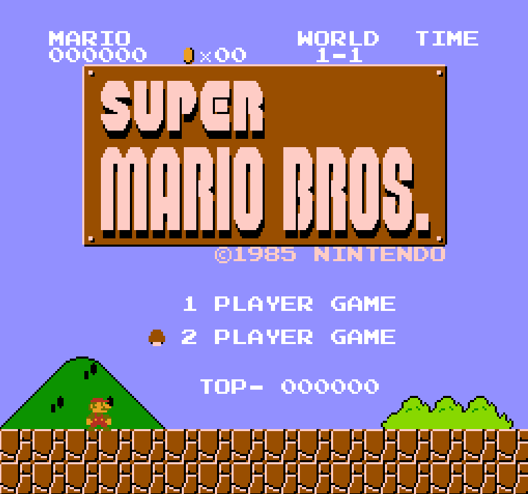
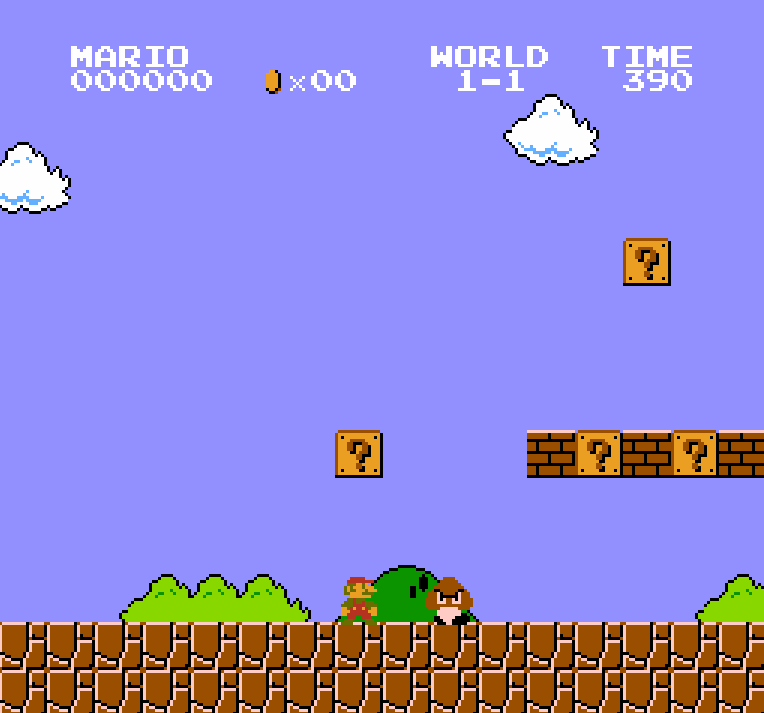
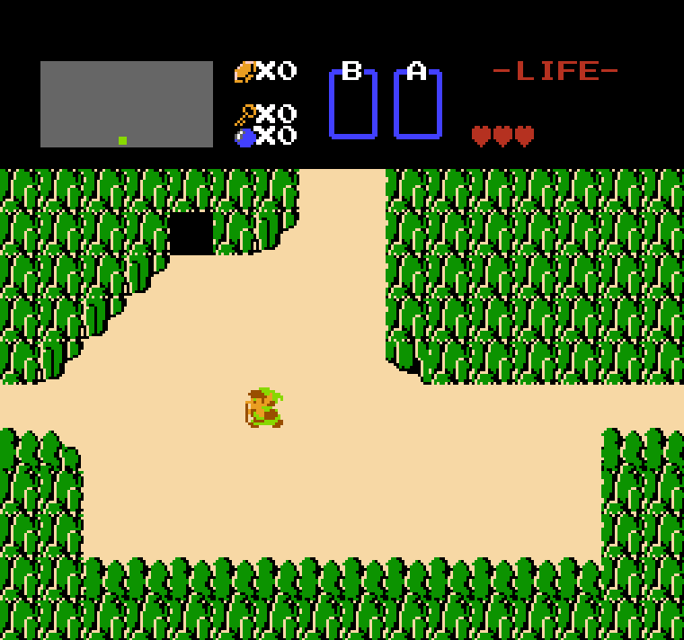

# NES Emulator

a nes emulator i wrote to learn how the nes works. its not perfect but it plays games!

## screenshots

**Super Mario Bros**




**Legend of Zelda**



## what works

- **CPU**: all official 6502 opcodes
- **PPU**: backgrounds, sprites, scrolling
- **APU**: sound! pulse, triangle, and noise channels
- **Mappers**: NROM (mapper 0) and MMC1 (mapper 1)
- **Input**: keyboard controls

## games tested

- Super Mario Bros - works great
- Legend of Zelda - works!
- Metroid - works
- Donkey Kong - works
- Mega Man 2 - works (needs mapper 1)

other mapper 0 and mapper 1 games should work too probably

## controls

| Key | NES Button |
|-----|------------|
| Z | A |
| X | B |
| Enter | Start |
| Shift | Select |
| Arrow keys / WASD | D-pad |
| Escape | Quit |

## building

you need:
- gcc (i use mingw on windows)
- SDL2

```bash
gcc -o nes main.c cpu.c bus.c cartridge.c ppu.c apu.c controller.c -Wall -lmingw32 -lSDL2main -lSDL2
```

or just use the makefile:

```bash
make
```

you'll need to fix the SDL paths in the makefile for your system tho

## running

```bash
nes game.nes
```

## known issues

- no mapper 4 (MMC3) so SMB3 and kirby dont work yet
- DMC channel not implemented (some sounds missing)
- audio might crackle sometimes, the buffer is kinda janky
- sprite overflow not implemented (8 sprite limit per scanline)
- some games might have timing issues

## resources i used

- [nesdev wiki](https://www.nesdev.org/wiki/Nesdev_Wiki) - literally everything i know about the nes
- [6502 reference](http://www.obelisk.me.uk/6502/reference.html) - opcode reference
- loopy's scroll doc - for understanding ppu scrolling (this took forever to understand)

## why

i wanted to learn how old consoles worked and emulation seemed like a cool project. turns out the nes is complicated but also really clever for 1983 hardware.

## license

MIT - see LICENSE file